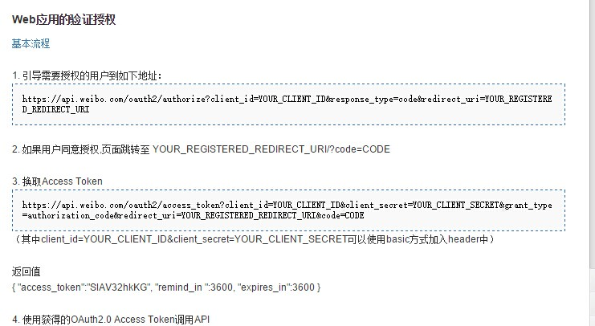
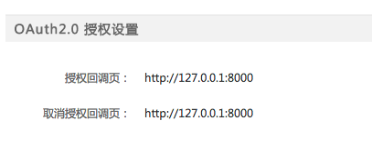
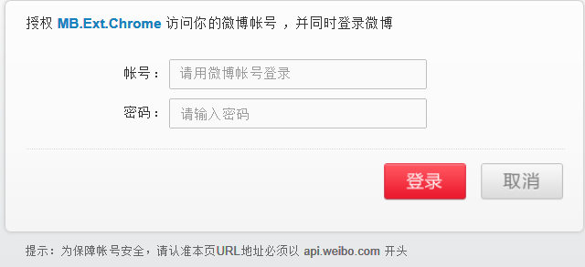
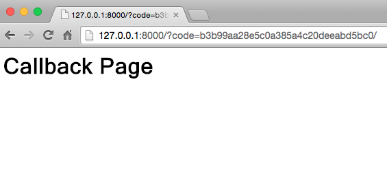

## App Authorization

### Overview
This step has the objective to get the authorization from the user to allow the app to do things on behalf of the user. As a result, you will get a token which allow you to call API to do things for specific user. Each token correponds to a user. 
  - Usually, a token has expiration time vafies from 1 day to several month. 

### Sina oauth
- The following figure shows how sina oauth works


### Authorization Step
- launch python server in local machine
  - create an index.html under current folder
  - start a web server by `python -m SimpleHTTPServer` (the default url will be 127.0.0.1:8000)
  - Why do this? Answer: to get the authorization code from callback
  ```
  Note it is not necessary to do this step. Launch a server is not necessary, you can still get the code.
  ```
- Create Weibo APP to get appkey and appsecret
  - apply for app, [guidance](http://open.weibo.com/wiki/%E6%96%B0%E6%89%8B%E6%8C%87%E5%8D%97)
  - remember to setup the authorization callback to your web server url, i.e., 应用信息>高级信息>授权回调页; Usually you will not have a server url, so that you can set it as `http://127.0.0.1:8000`, to use your local machine as a server
  
  

- Create a file name  `setting.json`
  - set the "appKey","appSecret","redirectUrl", here redirectUrl means 授权回调页, as shown [here](../src/setting.json)
- Execute the [example code](https://github.com/vczero/node-weibo/blob/master/examples/example.js) to get token
  - Copy the [example code](https://github.com/vczero/node-weibo/blob/master/examples/example.js)
  - First, run example 1 to authorize, it will open a webpage to allow you to login and authorize. After authorization you will be directed to the callback url which contains the code
    - Note the authorization code only works on Windows since it use the command `start` to open the web browser; You can modify the code to print out the url, and then open the web brower manually to visit the url
    - Modification of code
    
    

    - Log in to authorize
    
    
    
    - Authorization code is in the url, copy it!
    
    
    
  - Second, run example 2 using the code from step 1 
    - modify the code value you got from step 1
    ```
    var jsonParas = {
  	  code:"THE CODE YOU GOT FROM STEP 1",
  	  grant_type:"authorization_code"
    };
    ```
 
