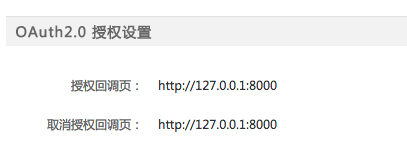
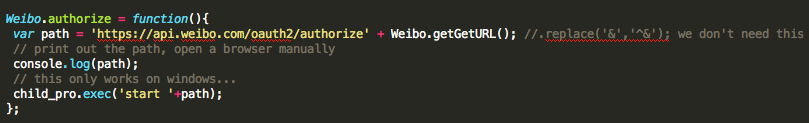
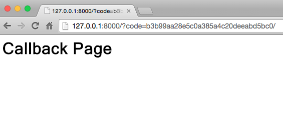

## Develop Procedure

### Develop environment
- [sublime Text](http://www.sublimetext.com/)

### Environment set-up
1. install [nodejs](http://nodejs.org/download/)
  - you may come across the error "nodejs/windows Error: ENOENT, stat 'C:\Users\RT\AppData\Roaming\npm'", see [solution](http://stackoverflow.com/questions/25093276/nodejs-windows-error-enoent-stat-c-users-rt-appdata-roaming-npm)

2. install [nodeweibo](https://www.npmjs.org/package/nodeweibo) package
  - `npm install nodeweibo`

### Authorization
- launch python server in local machine
  - create an index.html under current folder
  - start a web server by `python -m SimpleHTTPServer` (the default url will be 127.0.0.1:8000)
  - Why do this? Answer: to get the authorization code from callback
- Create Weibo APP to get appkey and appsecret
  - apply for app, [guidance](http://open.weibo.com/wiki/%E6%96%B0%E6%89%8B%E6%8C%87%E5%8D%97)
  - remember to setup the authorization callback to your web server url, i.e., 应用信息>高级信息>授权回调页; Usually you will not have a server url, so that you can set it as `http://127.0.0.1:8000`, to use your local machine as a server
  
- Change `node-weibo/lib/config/setting.json`
  - modify the "appKey","appSecret","redirectUrl", here redirectUrl means 授权回调页
- Execute the [example code](https://github.com/vczero/node-weibo/blob/master/examples/example.js) to get token
  - Copy the [example code](https://github.com/vczero/node-weibo/blob/master/examples/example.js)
  - First, run example 1 to authorize, it will open a webpage to allow you to login and authorize. After authorization you will be directed to the callback url which contains the code
    - Note the authorization code only works on Windows since it use the command `start` to open the web browser; You can modify the code to print out the url, and then open the web brower manually to visit the url
    - Modification of code
    
    - Log in to authorize
    
    - Authorization code
    
  - Second, run example 2 using the code from step 1 
 
